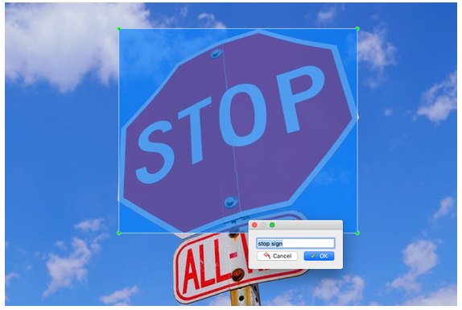
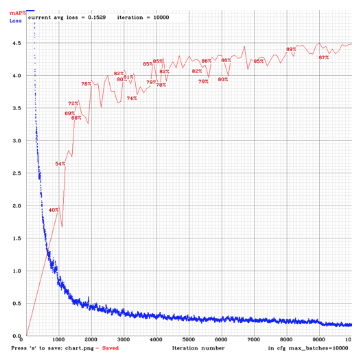

# Deep Learning Live Feed Object Detection

This project uses a Convolutional Neural Network (CNN) to automatically detect and track objects in real-time video feeds. The images used for training are annotated in yolov3 format with labelimg. DarkNet is used to train the model on GPU's and the output is collected to perform an analysis on the loss function. The OpenCV library is used to capture live stream video. Each frame is captured, processed with the model, integrated with an object detection bounding box, and displayed to the end user in real-time. 


## Getting Started

These instructions will allwo you to run your own live-stream object detection.

You can chose to [use the pre-trained model](#option-1-use-the-pre-trained-model)
or you can [train your own model](#option-2-train-a-custom-model)

### Prerequisites

Python3
opencv-python
matplotlib
google_images_search

### Clone Repository

This codebase was developed and tested in PyCharm.

Donwload the [PyCharm IDE](https://www.jetbrains.com/pycharm/download/) and clone this repository.

```
https://github.com/nashebismaily/deep-learning-live-feed-object-detection.git
```

### Option 1: Use the Pre-Trained Model

Download the pre-trained model from here 

[Pre-Trained ML Model](https://srv-file6.gofile.io/download/Bfj367/yolov3.weights)

Place yolov3.weights into this folder:

```
deep-learning-live-feed-object-detection/model/config
```

### Option 2: Train a custom Model

1. Download a set of images for an object you want to classify.

2. Use labelImg to annotate each image, ensure YOLO is set as the output type

    ```
    labelImg
    ```

    

3. Update the objects.names file to contain a list of objects that have been labeled

    ```
    deep-learning-live-feed-object-detection/model/config/objects.names 
    ```

4. Train the Model

    ```
    python3 deep-learning-live-feed-object-detection/src/main/model/TrainModel.py
    ```

5. Once training is complete, observe the loss graph found here

    ```
    deep-learning-live-feed-object-detection/model/graphs
    ```

    

6. Select the appropriate weight that correlates to the elbow in the loss graph and move that here

    ```
    deep-learning-live-feed-object-detection/model/config/yolov3.weights
    ```
    
### Detect objects in static images

1. Add the path for the source and destination images into the config under the image section

```
deep-learning-liveconf-feed-object-detection/ig/detection.cfg

input_image=/root/photos/input_photo.jpg
output_image=/root/photos/output_photo.jpg
```

2. Run the static image object detection


```
deep-learning-liveconf-feed-object-detection/src/main/detection/DetectImage.py
```

### Detect objects in video

1. Add the path for the source and destination videos into the config under the video section.

   Note: The output video needs to be in .avi format
   
```
deep-learning-liveconf-feed-object-detection/ig/detection.cfg

input_video=/root/videos/input_video.mov
output_video=/root/videos/output_video.avi
```

2. Run the video object detection

```
deep-learning-liveconf-feed-object-detection/src/main/detection/DetectVideo.py
```

### Detect objects in camera


1. Scan your cameras to detect available camera id's

```
deep-learning-liveconf-feed-object-detection/src/main/detection/ScanCameras.py

[0]
```

2. Update detection.cfg with your selected device id

```
deep-learning-liveconf-feed-object-detection/ig/detection.cfg

device_id=0
```

3. Run the live-stream  object detection

```
deep-learning-liveconf-feed-object-detection/src/main/detection/DetectCamera.py
```

### Results:

TODO


## Running the tests

Each module has its own set of unit test that can be run.

```
python3 TestDarkNet.py
python3 TestCaptureStraem.py
```

## Built With

* [DarkNet](https://pjreddie.com/darknet/)
* [Yolov3](https://pjreddie.com/darknet/yolo/)
* [OpenCV2](https://pypi.org/project/opencv-python/)

## Authors

* **Nasheb Ismaily** 

## License

This project is licensed under the MIT License - see the [LICENSE.md](LICENSE.md) file for details


